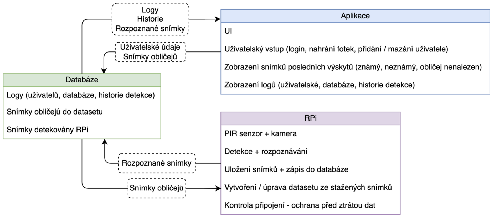
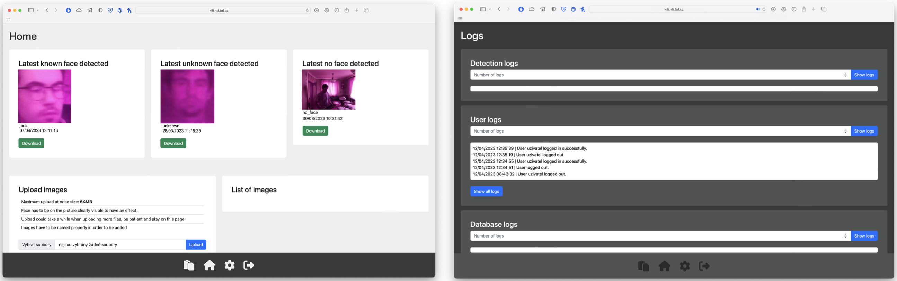
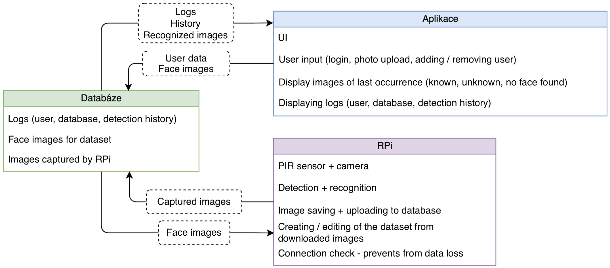

### English version below
# Kamerový bezpečnostní systém s rozpoznáváním obrazu

V dnešní době je stále rostoucí poptávka po vysoce kvalitních zabezpečovacích systémech. Tato bakalářská práce je zaměřena na vývoj moderního kamerového zabezpečovacího systému, který nejen monitoruje pohyb, ale také rozpoznává obličeje jednotlivých osob. Jedná se o systém, který spojuje backend v Pythonu s intuitivní webovou aplikací a hardwarem založeným na Raspberry Pi.

## Použité technologie
- __Backend__
  - Python (Flask)
- __Frontend__
  - HTML s Jinja2 template
  - CSS3 (Bootstrap)
  - JavaScript
- __Databáze__
  - MongoDB s GridFS
- __Server__
  - nginx webserver na CentOS 8

## Systém

### Raspberry Pi
- [Spuštění "aplikace" (main skript)](piApp/main.py)
- [Detekce](piApp/src_detection/detect.py)
- [Rozpoznávání](piApp/src_detection/recognize_faces_image.py)
- [Synchronizace s databází](piApp/src_sync_data/sync_data.py)

### Webová aplikace
- __Back-end__
  - [Spuštění aplikace (main skript)](app/main.py)
  - [Inicializace, konfigurace aplikace](app/website/__init__.py)
  - [Správa přístupu (login, logout, aktivita uživatele)](app/website/auth.py)
  - [Funkce uživatele](app/website/models.py)
  - [Hlavní funkce aplikace](app/website/views.py)
- __Front-end__
  - [Layout stránek (HTML)](app/templates/layout.html)
  - [Domovská stránka (HTML)](app/templates/home.html)
  - [Stránka s logy (HTML)](app/templates/dat_logs.html)
  - [Login stránka (HTML)](app/templates/login.html)
  - [Sign-up stránka (HTML)](app/templates/sign_up.html)
  - [Výpis všech logů (HTML)](app/templates/logs_all.html)
  - [Hlavní motiv aplikace (CSS)](app/static/css/light.css)
  - [Funkce tmavého režimu (JS)](app/static/js/darkmode.js)
  - [Zobrazení nastavení (JS)](app/static/js/settings.js)

### Server
- [Konfigurace nginx](config/nginx.conf)
- [Konfigurace aplikace jako služby](config/flask.service)

## Cíle a funkčnost
Cílem tohoto projektu byl návrh a realizace rychlého, přesného a automatického systému detekce obličejů. Byly testovány různé metody detekce, včetně Viola-Jones detektoru, Histogram orientovaných gradientů (HOG + SVM) a Konvoluční neuronové sítě (CNN). Aplikace poskytuje uživatelské rozhraní pro ovládání a konfiguraci systému, včetně možnosti rozšíření datasetu obličejů a zabezpečeného uchování citlivých dat.

[Celá bakalářská práce](readme_files/BP.pdf)

__Návrh systému__
- 

__Ukázka aplikace__
- 
#
### English version 

# Camera Security System with Image Recognition

Nowdays, there is a growing demand for high-quality security systems. This bachelor's thesis focuses on the development of a modern camera security system that not only monitors movement but also recognizes the faces of individual persons. It's a system that integrates a Python backend with an intuitive web application and hardware based on Raspberry Pi.

## Technologies Used
- __Backend__
  - Python (Flask)
- __Frontend__
  - HTML with Jinja2 template
  - CSS3 (Bootstrap)
  - JavaScript
- __Database__
  - MongoDB with GridFS
- __Server__
  - nginx webserver on CentOS 8

## System

### Raspberry Pi
- [Launch of the "app" (main script)](piApp/main.py)
- [Detection](piApp/src_detection/detect.py)
- [Recognition](piApp/src_detection/recognize_faces_image.py)
- [Synchronization with the database](piApp/src_sync_data/sync_data.py)

### Web Application
- __Back-end__
  - [Launch of the app (main script)](app/main.py)
  - [Initialization, configuration of the app](app/website/__init__.py)
  - [Access management (login, logout, user activity)](app/website/auth.py)
  - [User functions](app/website/models.py)
  - [Main functions of the app](app/website/views.py)
- __Front-end__
  - [Page layout (HTML)](app/templates/layout.html)
  - [Home page (HTML)](app/templates/home.html)
  - [Page with logs (HTML)](app/templates/dat_logs.html)
  - [Login page (HTML)](app/templates/login.html)
  - [Sign-up page (HTML)](app/templates/sign_up.html)
  - [List of all logs (HTML)](app/templates/logs_all.html)
  - [Main theme of the app (CSS)](app/static/css/light.css)
  - [Dark mode function (JS)](app/static/js/darkmode.js)
  - [Display settings (JS)](app/static/js/settings.js)

### Server
- [nginx configuration](config/nginx.conf)
- [App configuration as a service](config/flask.service)

## Goals and Functionality
The aim of this project was to design and implement a fast, accurate, and automatic face detection system. Various detection methods were tested, including the Viola-Jones detector, Histogram of Oriented Gradients (HOG + SVM), and Convolutional Neural Network (CNN). The application provides a user interface for controlling and configuring the system, including the possibility of expanding the face dataset and securely storing sensitive data.

[Complete bachelor's thesis](readme_files/BP.pdf)

__System Design__
- 

__App Showcase__
- 